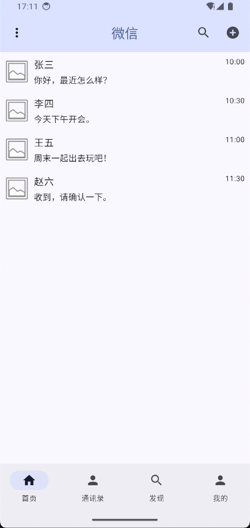
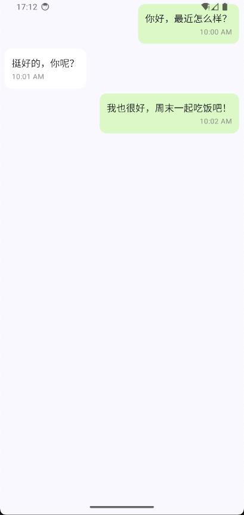

高仿微信8.0.54 (截止2024/12/15) 还在持续开发中...
============

## 目录
* [一、简述](#一简述)
* [二、功能](#二功能说明)
* [三、效果图](#三效果图展示)

# 一、简述

>本项目由 MislayG323 个人独立开发。
>
>项目源码地址：
>
>[GitHub：https://github.com/MislayG323/MWeiChat](https://github.com/MislayG323/MWeiChat)
>
>项目DemoApp下载：[Demo](app-debug.apk)

## 1、简单介绍：
这个项目是本人独立开发的第一个高仿微信项目，仿最新版微信8.0.54。使用 Jetpack Compose 模块化 开发。欢迎 Star 和 Fork~~

## 2、制作原因：

1. 熟练使用 Jetpack Compose 新安卓技术。
2. 模块化管理。

# 二、功能说明

## 1、首页

1. 聊天列表
2. 聊天详情页

# 三、效果图展示

